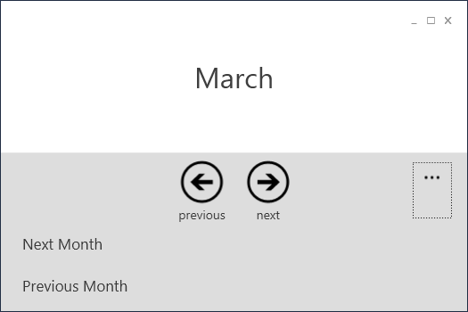

# Application Bar
The application bar has been modelled on the ApplicationBar of Windows Phone 7.  

**Here's an example of the application bar control:**

**Have a look at the XAML**
The complete Application Bar is bindable. 
{{
<AppBar:ApplicationBar Grid.Row="1">
    <AppBar:ApplicationBar.Icons>
        <AppBar:ApplicationBarIcon 
                ImageSource="/TpMetroWpfLibrary;component/Images/appbar.prev.png"
                Description="previous"
                Command="{Binding PrevCommand}"/>
        <AppBar:ApplicationBarIcon 
                ImageSource="/TpMetroWpfLibrary;component/Images/appbar.next.png"
                Description="next"
                Command="{Binding NextCommand}"/>
    </AppBar:ApplicationBar.Icons>
            
    <AppBar:ApplicationBar.MenuItems>
        <AppBar:ApplicationBarMenuItem 
                Description="Next Month" 
                Command="{Binding NextCommand}"/>
        <AppBar:ApplicationBarMenuItem 
                Description="Previous Month" 
                Command="{Binding PrevCommand}"/>
    </AppBar:ApplicationBar.MenuItems>
</AppBar:ApplicationBar>
}}

**Hint**
The Application Bar is currently not modelled on the ApplicationBar of Windows 8 - such a control is planned to be implemented soon.

The difference of both is, that the buttons can only be placed in the center. Also there are always the three dots of the menu items visible.
