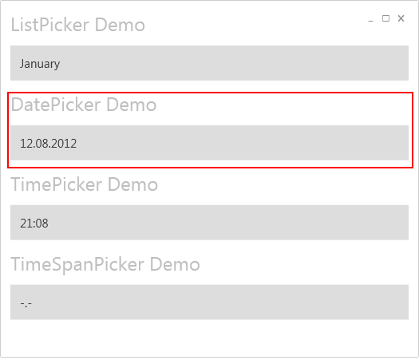
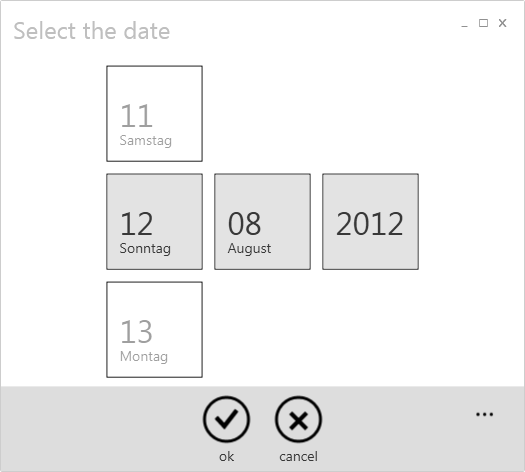

# Date Picker
Using the date picker the user can select a single day by scrolling the date, month and year selector panels. The DatePicker behaves like it does on Windows Phone 7.

**Here's an example of the DatePicker**
 

**How to define the DatePicker in XAML**
At first it's really important that the page has set the KeepAlive flag. That's because of the implementation of the Picker Control, which needs to hold an ID to identify the current instance of the Picker Control. If the KeepAlive flag is missing the ID might change and the result of the FullPage Selector won't be accepted.
{{
<Page x:Class="PickerControlDemo.Views.ExampleView"
      KeepAlive="True"  >
}}
The following example shows how to define the DatePicker in XAML.
{{
        <Picker:DatePicker 
            FullModeHeader="Select the date"
            Margin="{StaticResource WinMargin}" 
            IsTouchSelectionEnabled="True"
            Grid.Row="3" 
            Value="{Binding SelectedDate, Mode=TwoWay}"/>
}}
**Remark to IsTouchSelectionEnabled**
If IsTouchSelectionEnabled is not defined, the Framework will decided by it's own if a touch input dialog shall be shown or not. This depends if the user is working with a touchfriendly device or not. If you want to check that by your own, you can use the {{ DeviceInfo.HasTouchInput() }} method to proof it.

