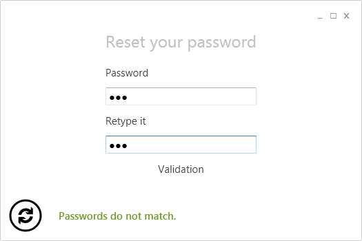

# Error Bar
The ErrorBar control can be used to show errors combined with a "Retry" button that can be bound to a command. The user can press the ReTry button in order to execute the failed command again.

**Here's an example of the ErrorBar**

**How to implement it in XAML**
The ErrorBar can be defined in XAML like in the example below.
{{
    <Error:DisplayErrorBar Command="{Binding FaultedCommand}" Text="{Binding Error}" />
}}
**How to use it in the view model**
The following example shows how to use the ErrorBar in the view model.
{{
        public void ExecuteValidateCommand(object sender, ExecutedRoutedEventArgs eventArgs)
        {
            Validated = null;

            // The Display Error Control is used to display any kind of error
            // Additionally you can set a Faulted Command that can be 
            // invoked by the Display Error Control
            if (string.IsNullOrEmpty(Password1))
            {
                Error = "A password is required";
                FaultedCommand = ValidateCommand;
                return;
            }
            
            Validated = Password1 == Password2;
            if (!Validated.Value)
            {
                Error = "Passwords do not match.";
                FaultedCommand = ValidateCommand;
            }
            else
            {
                // To hide the display error control, the error message must be resetted
                Error = string.Empty;
                FaultedCommand = null;
            }
        }
}}
**Hint**
Not always a command is given. Sometimes it would be better to bind the failed method itself, instead of a static command. If you want to do so, you can bind a DynamicCommand.
{{
public void DoSomething()
{
   try
   {
      // Try to load some data from the internet
   }
   catch (Exception exc)
   {
      Error = exc.message;
      FaultedCommand = new DynamicCommand( ()=>DoSomething() );
   }
}
}}