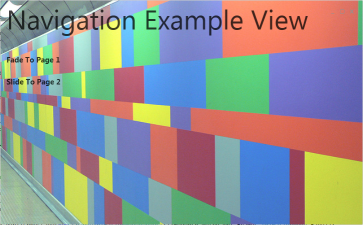
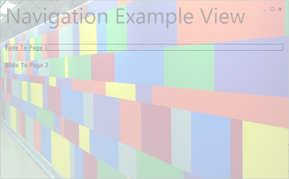
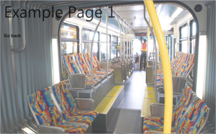

# The FaderFrame
The Fader Frame is a page transition where the first page fades out and the second page fades in. This transition is the standard transition for all Metro styled applications.

**Hint:**
It's recommended to use the [AnimationFrame](AnimationFrame) because it supports both navigation transitions.

**Example**
   