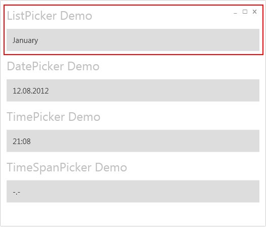
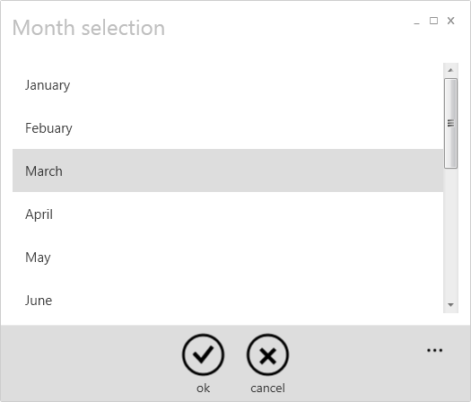
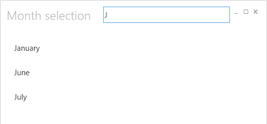

# List Picker
The ListPicker can be used to pick a unique object from a collection of objects. The ListPicker behaves like it does for Windows Phone 7.
On Touch or Click event a sub page opens where the user can select a single value by tapping it.

**Here a two screenshots**
 

**How to define the ListPicker in XAML**
At first it's really important that the page has set the KeepAlive flag. That's because of the implementation of the Picker Control, which needs to hold an ID to identify the current instance of the Picker Control. If the KeepAlive flag is missing the ID might change and the result of the FullPage Selector won't be accepted.
{{
<Page x:Class="PickerControlDemo.Views.ExampleView"
      KeepAlive="True"  >
}}
Here's an example that shows how to define the ListPicker in XAML.
{{
<Picker:ListPicker Grid.Row="1"  
                   ItemsSource="{Binding Months}" 
                   Margin="{StaticResource WinMargin}"
                   DisplayMemberPath="Text"
                   FullModeHeader="Month selection"
                   SelectedItem="{Binding SelectedMonth, Mode=TwoWay}">
    <Picker:ListPicker.FullModeItemTemplate>
        <DataTemplate>
            <TextBlock Text="{Binding Text}" 
                       Style="{StaticResource WinTextNormalStyle}" 
                       Margin="{StaticResource WinMargin}"/>
        </DataTemplate>
    </Picker:ListPicker.FullModeItemTemplate>
</Picker:ListPicker>
}}
**How to define a Quick Selection**
if the entries of your items source are implementing the IItemFilter interface, than the ListPicker will show the user a quick selection input box. The entries will than be filtered via the interface. Such a implementation could look like:
{{
    public class Resource : IItemFilter
    {
        public bool IsValueAccepted(string filter)
        {
            return filter == null 
               || Text.StartsWith(filter, StringComparison.InvariantCultureIgnoreCase);
        }
    }
}}
This would result in the following screen layout:
