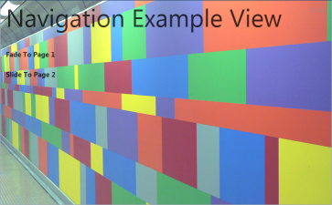
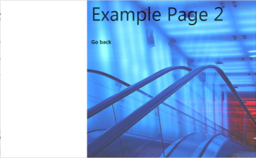

# Slider Frame
The Slider Frame is used to handle a sliding page transition. Old pages slides out to the left and new pages come from the right to slide to it's target position. This is reversed on GoBackNavigationRequest. So the SliderFrame can be ideally used for building Assistant or Setup Applications where the application leads the user through a predefined process.

**Hint:** 
It's recommended to use the [AnimationFrame](AnimationFrame) because it supports both navigation transitions.

**Example**
   