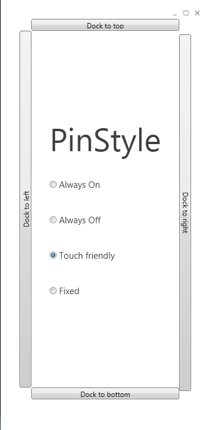

# Snapped Transparent Window
The SnappedTransparentWindow is an extension to the [TransparentWindow](TransparentWindow). The window is always docked to one side (left, top, right, bottom) of a screen and it has several behaviours that are selectable.

You'll find a good example for the SnappedTransparentWindow in our demo projects.

**Example:**

**XAML:**
{{
<Metro:SnappedTransparentWindow x:Class="SnappedWindowDemo.Views.MainWindow"
xmlns="http://schemas.microsoft.com/winfx/2006/xaml/presentation"
xmlns:x="http://schemas.microsoft.com/winfx/2006/xaml" 
xmlns:Metro="clr-namespace:TimePunch.Metro.Wpf.Metro;assembly=TpMetroWpfLibrary" 
xmlns:Commands="clr-namespace:TimePunch.Metro.Wpf.Commands;assembly=TpMetroWpfLibrary" 
xmlns:Frames="clr-namespace:TimePunch.Metro.Wpf.Frames;assembly=TpMetroWpfLibrary" 
DataContext="{Binding Source={StaticResource ViewModelLocator}, Path=MainWindowViewModel}"
Commands:ApplicationCommands.RegisterCommandBindings="{Binding RegisteredCommands}"
Title="MainWindow" Height="350" Width="525">
    <Grid>

    </Grid>
</Metro:SnappedTransparentWindow>

}}
**Dependency Properties:**
The SnappedTransparentWindow has the following Public Dependency Properties to define the stile.

* **PinStyle**
The PinStyle is an enumeration that defines how the SnappedTransparentWindow behaves. It can have one of the following states.
{{
    /// 

    /// The Pin Style defines how the window behaves at the desktop screen
    /// 

    public enum PinStyle
    {
        /// 

        /// Window is not pinned to the desktop
        /// 

        Undefined,

        /// 

        /// Window stays visible, but hides from the user
        /// 

        AlwaysOn,

        /// 

        /// Window is never visible, but shows on demand
        /// 

        AlwaysOff,

        /// 

        /// Window stays always visible
        /// 

        Fixed,

        /// 

        /// Windows will handled like Always off, but more Touch friendly
        /// The display won't disappear, when the mouse is moved out, but disappears
        /// when the user clicks
        /// 

        TouchFriendly
    }
}}

* **AnimationDuration** 
It's the TimeSpan how long the window needs to show or hide.

* **SlideInLatency**
The SlideInLatency defines the TimeSpan how long the window waits after an animation event to shor or hide. This can be used to finish prior animations, like the slide out of the Application Bar.

* **MagicKeyCode**
The Magic Key Code defines the key that will pins the window with PinStyle AlwaysOn. Have a look at the demo project to see how this works.

* **OpacityOnHold**
That's the opacity of the window if the PinStyle is set to Fixed or AlwaysOn.