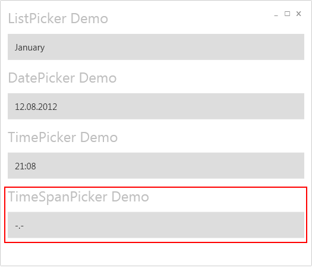
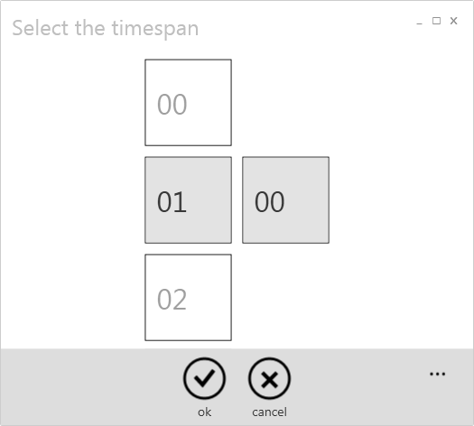

# TimeSpan Picker
Using the TimeSpan picker the user can select a timespan by scrolling the hour and minute selector panels. 

**Here's an example of the TimeSpanPicker**
 

**How to define the TimeSpanPicker in XAML**
At first it's really important that the page has set the KeepAlive flag. That's because of the implementation of the Picker Control, which needs to hold an ID to identify the current instance of the Picker Control. If the KeepAlive flag is missing the ID might change and the result of the FullPage Selector won't be accepted.
{{
<Page x:Class="PickerControlDemo.Views.ExampleView"
      KeepAlive="True"  >
}}
The following example shows how to define the TimeSpanPicker in XAML.
{{
        <Picker:TimeSpanPicker 
            FullModeHeader="Select the timespan"
            Margin="{StaticResource WinMargin}" 
            IsTouchSelectionEnabled="True"
            Grid.Row="7" 
            Value="{Binding SelectedTimeSpan, Mode=TwoWay}"/>
}}
**Remark to IsTouchSelectionEnabled**
If IsTouchSelectionEnabled is not defined, the Framework will decided by it's own if a touch input dialog shall be shown or not. This depends if the user is working with a touchfriendly device or not. If you want to check that by your own, you can use the {{ DeviceInfo.HasTouchInput() }} method to proof it.

